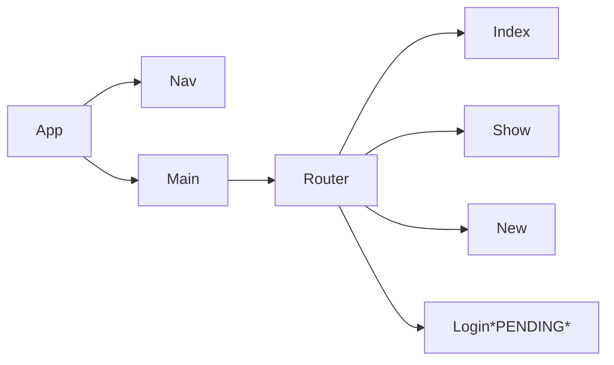

# Product Requirements Documentation

**Summary**
| Field | Detail |
|-------|--------|
| Project Name | Full Stack MERN Mobile APP |
| Description | Food POS system. |
| Live Website | https://resplendent-cucurucho-d85a88.netlify.app/ |
| Repo frontend | https://github.com/kellyluuu/FS-MERN-Mobile_F |
| Repo backend | https://github.com/kellyluuu/FS-MERN-Mobile_B |

## Route Tables

| Endpoint | Method | Response | Other |
| -------- | ------ | -------- | ----- |
| /menu | GET | JSON of all items | |
| /new | POST | Create new item return JSON of new item | body must include data for new item |
| /menu/:id | GET | JSON of item with matching id number | |
| /menu/:id | PUT | update item with matching idea, return its JSON | body must include updated data |
| /menu/:id | DELETE | delete the item with the matching id | |
| /auth/register | POST | PENDING | new user info must be included in body |
| /auth/login | POST | PENDING | username and password must be included in body |

## Component Architecture

## User Interface Mockups
